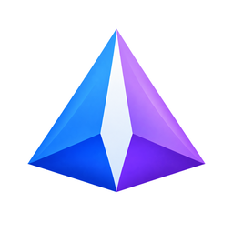

# Theoria



Theoria is a privacy-focused Android gallery for browsing, organizing, editing, and protecting
photos and videos. It is built with Kotlin, Jetpack Compose, and Android’s modern media APIs.

The name comes from the Greek *theōria*: contemplation or beholding. The app is intended to make
viewing and managing a personal media library feel calm, capable, and local-first.

[](https://github.com/Kenneth-Cho-InfoSec/Theoria/actions/workflows/nightly.yml)


## Current status

Theoria is currently in beta (`0.0.1-beta`). The project is under active development and should be
treated as a development build rather than a stable production release.

The current local configuration is an offline, no-ML build. Release artifacts are generated locally
and are not evidence of a published GitHub release.

## Features

- Local photo and video browsing with a Compose-based interface.
- Editing, albums, favourites, trash, wallpaper, casting, panorama viewing, and motion-photo support.
- Private/vault storage with encrypted media and backup-related functionality.
- Metadata inspection and privacy-focused metadata sanitization.
- Optional cloud and network providers, including Immich, ownCloud, Nextcloud, WebDAV, and SMB.
- Optional maps and on-device ML features when those build options are enabled.
- Native support for additional media formats through bundled codec integrations.

## Build variants and configuration

Build behavior is controlled by [`app.properties`](app.properties):

- `OFFLINE=true` removes network-related behavior and permissions from the offline build.
- `INCLUDE_MAPS` controls map support.
- `INCLUDE_IMMICH`, `INCLUDE_OWNCLOUD`, `INCLUDE_NEXTCLOUD`, `INCLUDE_WEBDAV`, `INCLUDE_SMB`, and
  `INCLUDE_NFS` control provider source sets when networking is enabled.
- `ALL_FILES_ACCESS` controls the optional broad-storage-access behavior.

The app also has `WithML` and `NoML` product flavors, plus ABI flavors for universal, ARM64, and
other supported Android architectures. The `NoML` flavor omits bundled ML model assets.

## Build locally

Use JDK 17 and the Android SDK/NDK versions declared by the project. Common commands are:

```bash
# Compile the debug Kotlin sources
./gradlew :app:compileUniversalNoMLDebugKotlin

# Run the JVM unit tests
./gradlew :app:testUniversalNoMLDebugUnitTest

# Build the offline, no-ML universal release APK
./gradlew :app:assembleUniversalNoMLRelease
```

The release APK is written under:

```text
app/build/outputs/apk/universalNoML/release/
```

The release build currently uses the project’s configured debug signing configuration unless the
release signing configuration and its credentials are explicitly wired into the build. Do not
present locally generated artifacts as officially signed distribution packages without verifying
their certificate separately.

## License and provenance

Theoria contains code from multiple provenance categories:

- Project-owned new code and independently authored additions are licensed under the [Mozilla
  Public License 2.0](LICENSE-MPL) where marked with `SPDX-License-Identifier: MPL-2.0`.
- Inherited upstream code remains under the [Apache License 2.0](LICENSE) where marked with
  `SPDX-License-Identifier: Apache-2.0`.
- Third-party libraries, vendored codec sources, generated files, model assets, and other bundled
  material retain their original licenses and notices.

Apache-origin code is not relicensed merely because it has been modified. A replacement may be
marked MPL 2.0 only after it has been independently implemented and its provenance reviewed.
See [`LICENSE-EXCLUSIONS.md`](LICENSE-EXCLUSIONS.md) for the detailed boundaries and exclusions.

## Contributing

When adding code, preserve upstream copyright notices and third-party licenses. New independently
authored files should include an SPDX header, and changes that replace inherited code should keep a
clear provenance record. Please run the relevant unit tests and a build before submitting changes.

Bug reports and feature requests can be opened in the project’s issue tracker:

<https://github.com/Kenneth-Cho-InfoSec/Theoria/issues>

## Developer

**kennethcho**: <https://github.com/Kenneth-Cho-InfoSec>
